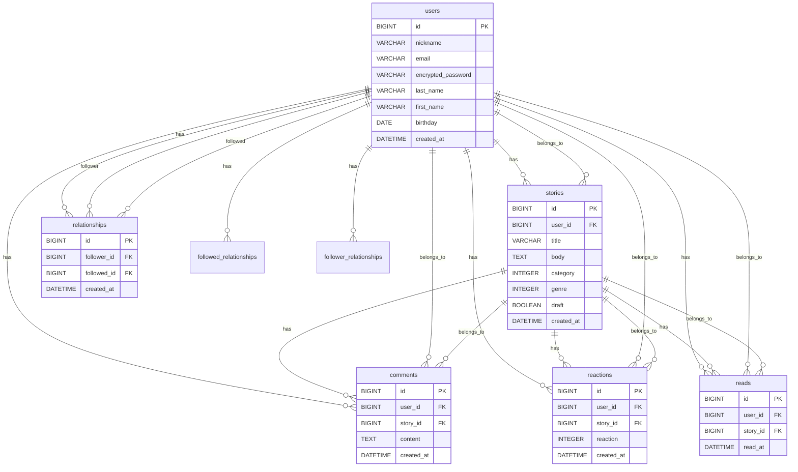

```
## usersテーブル
ニックネーム-nickname  (string型, NOT NULL)
メールアドレス-email   (string型, NOT NULL)
パスワード-password    (string型, NOT NULL)
名字-last_name        (string型, NOT NULL)
名前-first_name       (string型, NOT NULL)
生年月日-birthday      (date型, NOT NULL)
※アイコン画像はActiveStorageのため含めない

アソシエーション
has_many :stories
has_many :comments
has_many :reactions
has_many :reads
has_many :relationships
has_many :followings, through: :relationships
has_many :followers, through: :relationships


## storiesテーブル
タイトル-title       (string型, NOT NULL)
本文-body           (text型, NOT NULL)
カテゴリー-category  (integer型 NOT NULL)
  ※実話/創作
ジャンル-genre       (integer型 NOT NULL)
  ※日常/人間関係/仕事勉強/旅行/夢/SF
下書き-draft         (boolean型)
※ trueなら下書き、falseで公開
user                (references型, NOT NULL, 外部キー)

アソシエーション
belongs_to :user
has_many :comments
has_many :reactions
has_many :reads


## commentsテーブル
コメント-content  (text型)
user             (references型, NOT NULL, 外部キー)
story            (references型, NOT NULL, 外部キー)

アソシエーション
belongs_to :user
belongs_to :story


## reactionsテーブル
リアクション種別-reaction (integer型, NOT NULL)
  ※ enumで管理（例：0=感動, 1=すごい, 2=面白い, 3=パチパチ）
user                    (references型, NOT NULL, 外部キー)
story                   (references型, NOT NULL, 外部キー)

アソシエーション
belongs_to :user  
belongs_to :story


## relationshipsテーブル
フォローするユーザー-follower    (references型, NOT NULL, 外部キー, class_name: "User")
フォローされるユーザー-followed  (references型, NOT NULL, 外部キー, class_name: "User")

アソシエーション：
belongs_to :follower, class_name: "User"
belongs_to :followed, class_name: "User"


## readsテーブル
リアクション種別-reaction (integer型, NOT NULL)
  ※ enumで管理（例：0=感動, 1=すごい, 2=面白い, 3=パチパチ）
user                    (references型, NOT NULL, 外部キー)
story                   (references型, NOT NULL, 外部キー)

アソシエーション
belongs_to :user  
belongs_to :story
```